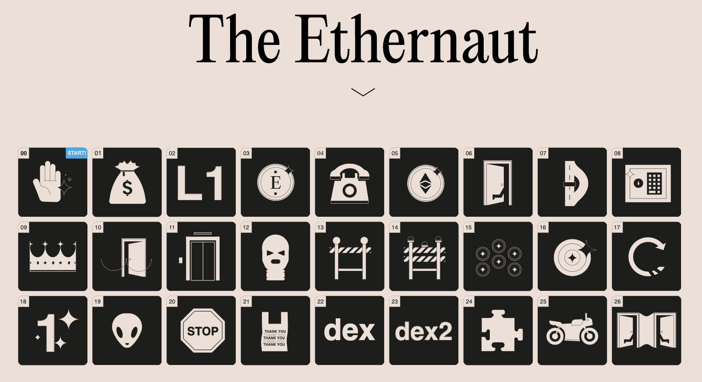

# Security Pills

Hey, this is part of the [Security Pills Newsletter](https://securitypills.news/) project:

> Staying up to date with all the different news occuring in the industry is near impossible. I created this curated list to help you solve that problem.

> The Security Pills Newsletter is a hand curated list that brings you the news, latest research, tips, and vulnerabilities focused to the appsec and smart contract landscape.

> Once subscribed, you will receive every Monday an email with the most significant links. Sometimes I also write [blog posts](https://securitypills.news/articles) on technical stuff or about anything else of interest to me.

# Ethernaut Challenges

[Ethernaut](https://ethernaut.openzeppelin.com/) is OpenZeppelin Web3/Solidity based wargame to learn about Ethereum smart contract security and become familiar with programming principles in [Solidity](https://docs.soliditylang.org/en/v0.8.15/).

Although the game was launched few years ago it has become a good place to start for those who are interested on security and smart contracts.

Challenges are currently running on the [Rinkeby testnet](https://www.alchemy.com/overviews/rinkeby-testnet) and you will require to use a Rinkey Faucet to get free testnet ETH and test the smart contracts.

This repository is my little contribution to those interested on learning the basics on Ethereum smart contract security by providing  guidance and explanations on how to solve each Ethernaut challenge using [brownie framework](https://github.com/eth-brownie/brownie). There are different approaches and frameworks that can be used, rather than the approach you will find here, so feel free to explore and learn from others.

You can find my solutions on this repository and a detailed walkthrough for each separate challenge in my [blog](https://securitypills.news/articles/ethernaut/).

Let's go over these Ethernaut's challenges and learn few security aspects of smart contracts written in Solidity!

